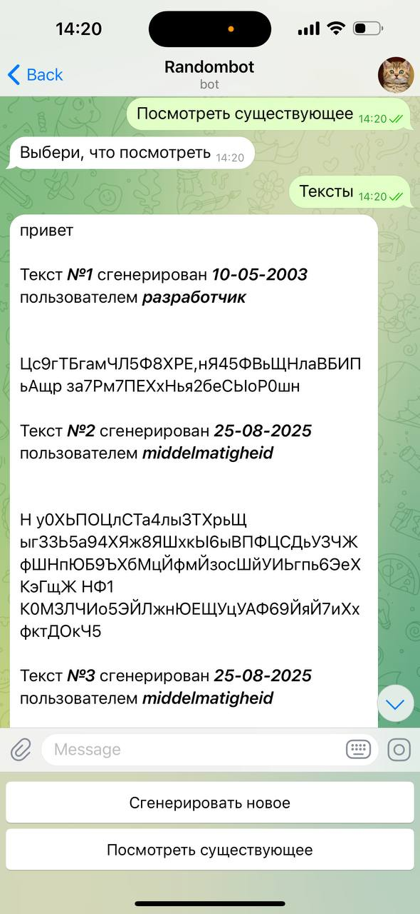
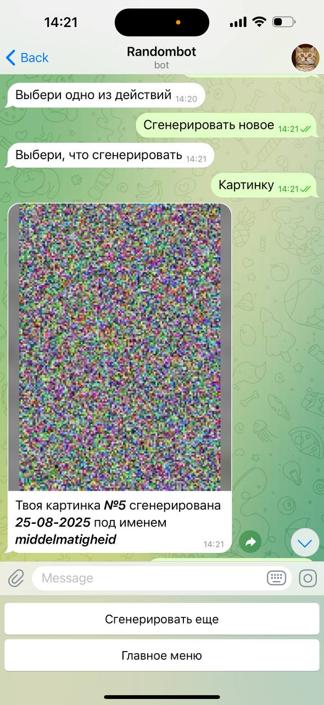

# aiogram-randombot

<div style="display: flex; gap: 25px; justify-content: center;">
    
    
</div>

# About the project

Telegram bot is based on 'The library if Babel' and 'Infinite monkey theorem'

'The library if Babel' narrates about library, which stores books, that contains all possible symbols combinations. Despite most of them contains just random combinations and nothing useful, some of them contains all information about whole universe, about life of every person, who ever lived or would live on Earth, all written books by humans and just everything, that you can imagine, is already stored in those books

'Infinite monkey theorem' states that a monkey hitting keys independently and at random on a typewriter keyboard for an infinite amount of time will almost surely type any given text, including the complete works of William Shakespeare

As you can see those two paradoxes about randomness are quite astonishing, therefore I decided to recreate it in telegram bot using python with aiogram and psycopg2

Telegram bot can generate random texts and images, stores them in database, and allows to view them all

Who knows what can be generated there

# Main functions

- Generating random texts and images
- Viewing texts and images generated by users

# Used in project

- Python 3.8+
- Aiogram - for operating the telegram bot
- Psycopg2 (PostgreSQL) - for operating the database
- Pillow - for generating images

# Downloading and running the bot

### 1. Download [Python](https://www.python.org/) and IDE

You can use any IDE you want, for example: PyCharm, VSCode, Python IDLE, etc.

### 2. Download ZIP or use git clone

```bash
git clone https://github.com/middelmatigheid/aiogram-randombot.git
cd aiogram-randombot
```

### 3. Create virtual environment

If you are using Linux/MacOS

```bash
python -m venv venv
source venv/bin/activate
```

If you are using Windows

```bash
python -m venv venv
venv\Scripts\activate 
```

### 4. Install requirements

```bash
pip install -r requirements.txt
```

### 5. Set up the database

- Download [PostgreSQL](https://www.postgresql.org/)
- Configure the database in pgAdmin4

### 6. Create a telegram bot

Create a telegram bot using [@BotFather](https://telegram.me/BotFather)

### 7. Create .env file

Create .env file in the main directory and set up the values

```bash
BOT_TOKEN='YOUR BOT TOKEN'
HOST='YOUR HOST'
DBNAME='YOUR DBNAME'
USER='YOUR USERNAME'
PASSWORD='YOUR PASSWORD'
PORT=YOUR PORT
```

### 8. Run the bot

```bash
python main.py
```

# Project structure

```bash
aiogram-randombot/
├── main.py               # Main file to run the bot
├── app/
│   ├── handlers.py       # File for handling bot's requests
│   └── database.py       # File for operating the database
├── images/               # Directory for saving generated images
├── requirements.txt      # Python requirements
└── .env                  # Environment variables
```
